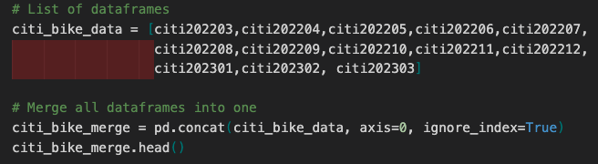
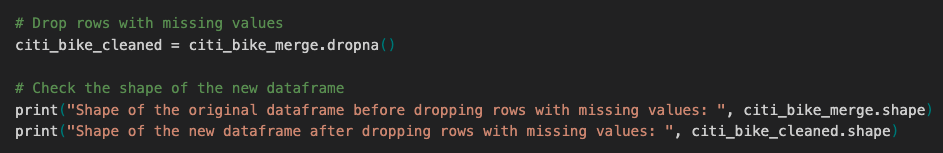
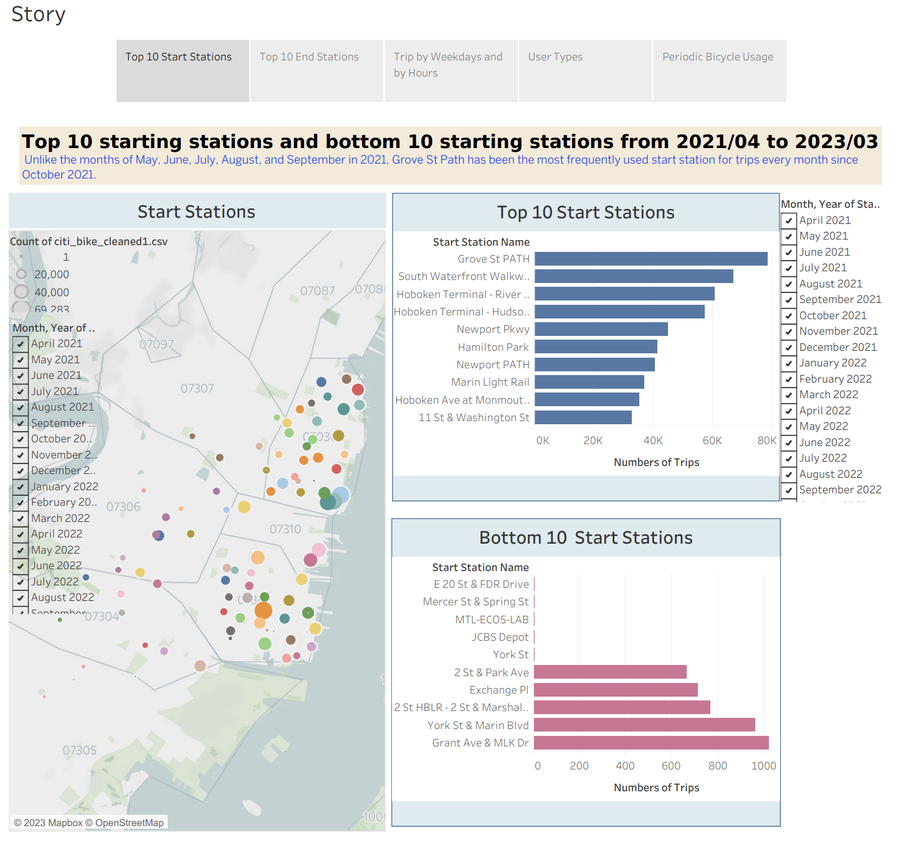
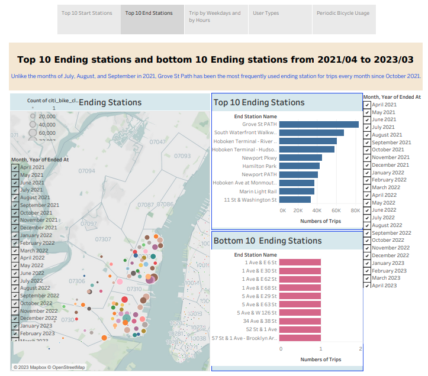
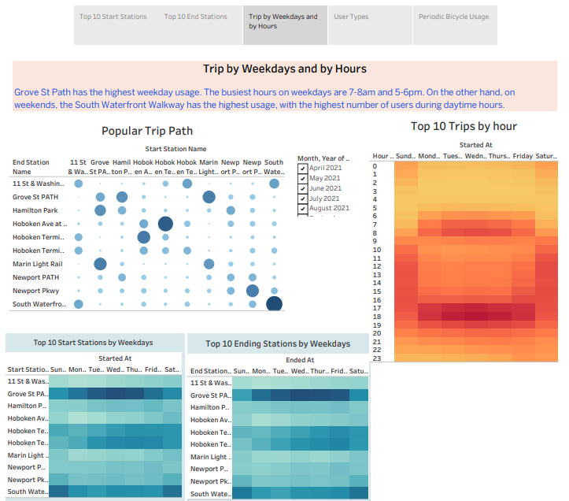
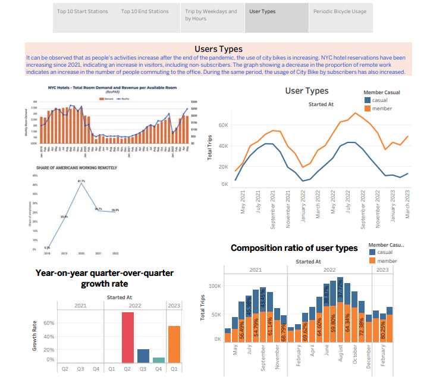
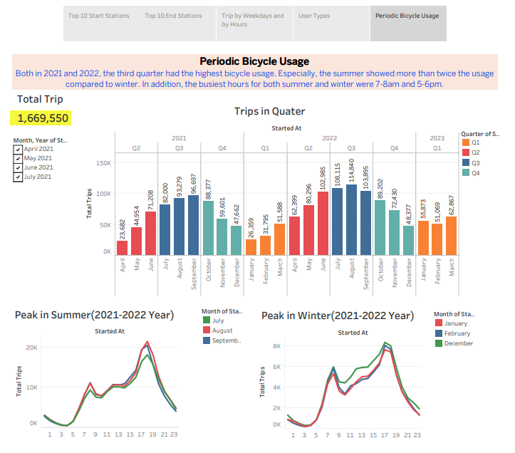

# City_Bike_Tableau
Since 2013, the Citi Bike program has implemented a robust infrastructure for collecting data on the program's utilization. Each month, bike data is collected, organized, and made public on the Citi Bike DataLinks to an external site. webpage.

However, while the data has been regularly updated, the team has yet to implement a dashboard or sophisticated reporting process. City officials have questions about the program, so my first task on the job is to build a set of data reports to provide the answers.

## Data Collect, Merging and Cleaning

## Visualization by Tableau
link : https://public.tableau.com/app/profile/unghwan.ahn/viz/City_bike2021_2023_12/Story1?publish=yes

